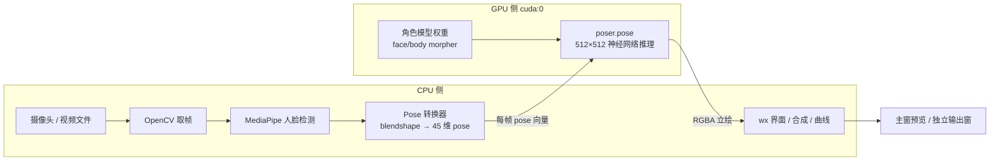

# 硬件需求评估 / Hardware Requirements

本文档基于当前代码路径与典型 THA4 用法做**工程估算**，非在你机器上实测的基准分数。  
评估对象：

| 版本 | 入口脚本 |
|------|----------|
| **原版** | `talking-head-anime-4-demo/src/tha4/app/character_model_mediapipe_puppeteer.py` |
| **实验增强版（Load Preview）** | `experiments/puppeteer_load_preview/character_model_mediapipe_puppeteer_load_preview.py` |

两者均默认 **`torch.device("cuda:0")`**，角色渲染分辨率 **`IMAGE_SIZE = 512`**，动画定时器约 **30–33 ms/帧（~30 FPS）**。

---

## 1. Workload 构成（什么在吃硬件）

| 子系统 | 主要占用 | 说明 |
|--------|----------|------|
| **SIREN Morpher（角色图）** | **GPU 显存 + GPU 算力** | `poser.pose()` 每帧在 GPU 上推理；加载 `face_morpher.pt` + `body_morpher.pt` 与立绘纹理 |
| **MediaPipe Face Landmarker v2** | **CPU**（为主） | 视频流人脸关键点 + blendshape；`RunningMode.VIDEO` |
| **OpenCV 摄像头/视频** | **CPU** | 采集、解码、格式转换；多后端探测（增强版） |
| **wxPython UI** | **CPU + 内存** | 主窗、控件、位图刷新；增强版另有**独立输出窗**、完整调参窗等 |
| **显示合成（增强版）** | **CPU + 额外 GPU** | 平移/缩放/旋转/镜像；**抗锯齿 >1.0 时按倍率放大渲染分辨率再缩小** |
| **音频张嘴（增强版）** | **CPU + 音频设备** | `sounddevice` 麦克风或 WASAPI 内录；与 OBS/直播助手争用声卡 |
| **示例模型包** | **磁盘 + 内存** | `packaged/bai_450k/`（face 0010 + body 0045 等） |

**与直播软件同开时额外占用（本评估假设同时运行）：**

| 软件 | 典型占用 |
|------|----------|
| **OBS Studio** | 编码（x264 吃 CPU / NVENC 吃 GPU 显存与编码单元）、预览、虚拟摄像头、浏览器源等 |
| **快手直播助手** | 采集、美颜/滤镜、编码推流、弹幕/贴纸；多数为 **CPU + GPU + 内存** |
| **虚拟摄像头链** | DroidCam / OBS Virtual Cam 等会增加 **CPU 拷贝与延迟**，不额外要 GPU，但加重调度 |

---

## 2. 单独运行（仅 THA4 Puppeteer）

### 2.1 原版 `character_model_mediapipe_puppeteer.py`

| 项目 | 最低可玩 | 推荐 |
|------|----------|------|
| **操作系统** | Windows 10/11 64 位 | 同左 |
| **GPU** | NVIDIA，**6 GB 显存**（如 GTX 1060 6G） | **8 GB+**（RTX 3060 / 4060 同级） |
| **GPU 驱动** | 支持 CUDA 的近期驱动 | 保持更新 |
| **CPU** | 4 核 8 线程（i5-8代 / R5 2600 级） | 6 核 12 线程+ |
| **内存** | **8 GB**（系统 + Python + 模型偏紧） | **16 GB** |
| **磁盘** | **SSD**，预留 **≥5 GB**（venv、MediaPipe `.task`、角色包） | NVMe SSD |
| **摄像头** | USB 720p@30 | 1080p@30，直连 USB3 |
| **音频** | 无硬性要求（原版无音频张嘴） | — |

**预期表现（单独）：** 在推荐配置上，512 渲染 + 单摄像头 + MediaPipe 一般可维持 **~25–30 FPS** 量级；最低配可能出现掉帧或 UI 迟滞。

---

### 2.2 实验增强版 Load Preview

在**原版同一套 GPU 推理**之上，增加：

- 独立无边框**输出窗**（默认约 `512×1.5` 像素级画布）
- 人脸跟踪 **自动平移/缩放/倾斜** 与曲线预览绘制
- 可选 **抗锯齿强度 > 1.0**（按倍率放大离屏渲染，**显存与 GPU 时间近似按倍率平方增长**）
- 多视频源枚举、文件源、音频张嘴（内录与 OBS 争用 WASAPI）
- 更多 wx 控件刷新（竖滑块、状态文本、曲线区等）

| 项目 | 最低可玩 | 推荐 |
|------|----------|------|
| **GPU 显存** | **6 GB**（抗锯齿保持 **1.0**，输出窗不要过大） | **8 GB+**；开 AA **>1.2** 建议 **10–12 GB** |
| **CPU** | 6 核 12 线程 | 8 核 16 线程+（MediaPipe + 多窗 UI + 合成） |
| **内存** | **16 GB** | **16–32 GB** |
| **磁盘 / 其他** | 同原版 | 同原版；内录需 **WASAPI** 输出设备 |

**相对原版的单独运行差异：** 增强版在「推荐配置」下通常比原版多占 **约 0.5–2 GB 系统内存**、**约 10–25% CPU**（视是否开 AA、输出窗大小、摄像头分辨率而定）；GPU 在 **AA=1.0 且输出窗接近默认** 时接近原版，**AA 拉高或输出窗很大时 GPU/显存明显高于原版**。

---

## 3. 与 OBS、快手直播助手等同时运行

假设典型直播链路：

```text
物理摄像头 / 虚拟摄像头
    → THA4 Puppeteer（面捕 + 角色渲染）
    → OBS 或 快手直播助手（编码推流）
    → 平台
```

或 THA4 输出窗/虚拟 cam 被 OBS 再采集一层。

### 3.1 资源叠加（定性）

| 资源 | THA4（增强版） | OBS（常见） | 快手直播助手（常见） | 合计压力 |
|------|----------------|-------------|----------------------|----------|
| **GPU 显存** | 2–4 GB 工作集 | +0.5–2 GB（预览/源） | +0.5–2 GB | **易超 6 GB**；NVENC 与 CUDA 同卡时争用 |
| **GPU 算力** | 30 FPS×512 推理 | NVENC 或 x264 | 美颜/编码 | **同卡易掉 THA4 帧率或 OBS 掉帧** |
| **CPU** | MediaPipe + OpenCV + UI | 编码/混音/浏览器源 | 美颜/推流 | **6 核以下易满载** |
| **内存** | 2–4 GB 进程级 | 1–3 GB | 1–4 GB | **16 GB 紧张，32 GB 宽裕** |
| **音频** | 内录 WASAPI | 麦克风/桌面音频 | 麦克风 | **设备/独占模式冲突**需手动选设备 |
| **USB/总线** | 摄像头 | 采集卡/第二摄像头 | 摄像头 | 带宽不足会掉帧 |

### 3.2 同时运行：最低 vs 推荐

| 场景 | 最低可玩 | 推荐（直播向） |
|------|----------|----------------|
| **原版 + OBS 或 快手（二选一）** | GPU **8 GB**；CPU **6C12T**；RAM **16 GB**；编码尽量 **NVENC** 且 THA4 **AA 关闭/无** | GPU **12 GB**（如 RTX 3060 12G / 4060 8G+）；CPU **8C16T**；RAM **32 GB**；720p 推流 |
| **增强版 + OBS + 快手（三者同开）** | 不推荐最低配硬扛；若必须：GPU **10 GB+**，RAM **32 GB**，THA4 **AA=1.0**、输出 **≤768p**、摄像头 **720p** | GPU **12–16 GB**（4070/4070 Ti 级）；CPU **8C16T+**；RAM **32 GB**；OBS **NVENC**；THA4 与直播软件 **分机位/分音频设备** |

### 3.3 同时运行时的调参建议（减轻争抢）

1. THA4：**抗锯齿 = 1.0**；输出窗不要拉得比必要更大。  
2. OBS：推流 **720p30** 优先于 1080p60（同卡 GPU 时）。  
3. 编码：NVIDIA 卡优先 **NVENC**，减轻 CPU，但与 THA4 **共享 GPU**。  
4. 音频：THA4 用「麦克风」、OBS 用另一输入，或反之；避免多程序同时独占同一 WASAPI 设备。  
5. 摄像头：尽量不用「OBS 虚拟 cam → 再被 THA4 打开」的双层链；优先 **物理 cam 进 THA4**，THA4 窗口/虚拟 cam 进 OBS。  
6. 增强版若卡顿：先关「曲线预览刷新」「方向/缩放自动校准」缩短周期，再降摄像头分辨率。

---

## 4. 原版 vs 实验增强版（对照表）

| 维度 | 原版 Puppeteer | 实验增强版 Load Preview | 差异说明 |
|------|----------------|-------------------------|----------|
| **GPU 推理核心** | 512 SIREN，`cuda:0` | 相同 | 一致 |
| **目标帧率** | 定时器 ~30 ms | 动画 ~33 ms；采集处理 ~33 ms，预览 UI ~66 ms | 增强版略节流预览，但合成/双窗可能抵消收益 |
| **显存（典型）** | 约 **2–4 GB** | **2–6 GB**（AA、大输出窗 ↑） | AA>1 时差距最大 |
| **CPU（典型）** | 中 | **中高** | 多窗、合成、曲线绘制、设备扫描 |
| **内存（典型）** | 约 **1.5–3 GB** 进程 | **2–4 GB** 进程 | 多窗位图与状态 |
| **摄像头** | 固定 `VideoCapture(0)` | 多设备/多后端/文件源 | 启动扫描时 CPU 尖峰 |
| **音频** | 无 | 麦克风 + 内录 +（fork）电平条 | 与直播软件争音频 |
| **UI 复杂度** | 单窗 | 紧凑/完整双模式 + 独立输出窗 | wx 刷新面更大 |
| **单独运行推荐 GPU** | 8 GB | 8 GB（AA 低）/ 10 GB+（AA 高） | 增强版上限更高 |
| **与 OBS 同开推荐** | 16 GB RAM + 8 GB VRAM | **32 GB RAM + 10–12 GB VRAM** | 增强版更吃整机 |

---

## 5. 软件与环境依赖（与硬件相关）

| 依赖 | 影响 |
|------|------|
| **CUDA 版 PyTorch** | 无 NVIDIA GPU 时需改代码改 CPU，帧率通常 **不可用于实时直播** |
| **Python venv**（`talking-head-anime-4-demo/venv`） | 磁盘与首次加载时间 |
| **MediaPipe `face_landmarker_v2_with_blendshapes.task`** | 磁盘约数十 MB；运行时 CPU |
| **可选 `pygrabber`** | 仅影响设备列表，略增 CPU |
| **Windows 10/11** | 与 DSHOW/MSMF/WASAPI 行为相关 |

---

## 6. 无法满足需求时的现象（便于对照）

| 现象 | 可能原因 |
|------|----------|
| 角色预览 <15 FPS | GPU 不足或 OBS NVENC 与 CUDA 同卡争用 |
| 摄像头卡、UI 假死 | CPU 满或 USB 带宽/驱动；增强版多后端探测阶段 |
| 闪退 / CUDA OOM | 显存不足；**抗锯齿或输出窗过大** |
| 有画面但嘴型/头延迟大 | MediaPipe CPU 瓶颈或定时器堆积 |
| 音频张嘴无反应 / 设备忙 | 与 OBS/快手占用麦克风或内录冲突 |
| 仅增强版卡、原版流畅 | 关 AA、缩小输出窗、关曲线/双校准 |

---

## 7. 项目原理（帮助理解硬件在干什么）

本节说明 **THA4 MediaPipe Puppeteer 实际在算什么**，便于判断「12 GB 显存」到底是指 **本项目本身**，还是指 **直播整机方案**。

### 7.1 一帧画面是怎么产生的



用一句话概括：**摄像头在 CPU 上被解码并做人脸分析；真正「画立绘」的是 GPU 上的神经网络；最后再由 CPU 把图画到窗口里（增强版还有缩放、旋转、抗锯齿合成）。**

因此：

- **觉得 CPU 占用高** → 多半来自 MediaPipe + 多窗口 UI，不是 morpher 算不动。  
- **觉得 GPU 占用高** → 来自 **每秒约 30 次** 的 `512×512` 级推理，以及（增强版）**故意放大分辨率再缩小** 的抗锯齿。

### 7.2 各阶段与硬件的对应关系

| 阶段 | 代码大致位置 | 硬件 | 是否实时必需 |
|------|----------------|------|----------------|
| 读摄像头 | `cv2.VideoCapture` | CPU + USB | 是 |
| 人脸关键点 | `FaceLandmarker`（`.task` 模型） | **主要是 CPU** | 是 |
| 表情 → 骨骼参数 | `MediaPoseFacePoseConverter00.convert()` | CPU | 是 |
| 立绘渲染 | `poser.pose(torch_source_image, pose)` | **GPU + 显存** | 是 |
| 显示到屏幕 | `wx.Bitmap` / `OutputFrame` | CPU + 系统内存 | 是 |
| 抗锯齿（增强版） | `antialias_factor` 放大离屏再缩小 | **GPU 显存 ↑↑** | 否（可调） |
| 音频驱动嘴型 | `sounddevice` + RMS | CPU + 声卡 | 否（可选） |

**重要：** 项目**强制默认** `device = torch.device("cuda:0")`。没有 NVIDIA GPU 时，需要改代码才能用 CPU 推理，速度通常**无法**当作实时面捕使用。这不是「设置里选一下」就能解决的。

### 7.3 GPU 显存花在哪里（量级直觉）

以下为 **单独运行 THA4、已加载角色模型** 时的典型层次（非精确测量）：

| 显存用途 | 大致量级 | 说明 |
|----------|----------|------|
| PyTorch / CUDA 运行时 | ~0.5–1.5 GB | 库与上下文，首次 `import torch` 即有基础占用 |
| `face_morpher.pt` + `body_morpher.pt` | ~0.1–0.5 GB+ | 取决于 checkpoint；常驻 GPU |
| 立绘源图 `character.png` 张量 | 数 MB–数十 MB | 与立绘分辨率有关 |
| **每帧推理中间激活** | 与 **512×512** 及网络宽度有关 | 约 **30 次/秒** 重复分配/复用 |
| 增强版抗锯齿缓冲 | **≈ (512×AA)²** 量级 | AA=1.5 时，面积约为 1.0 的 **2.25 倍** |

所以：

- **仅 THA4、AA=1.0、单输出**：很多 **6–8 GB** 显卡可以工作，文档里「单独推荐 8 GB」指的是这一档。  
- **并不是**「这个项目本体必须 12 GB 才能启动」。

### 7.4 为什么文档里仍写「12 GB」（和「夸张」之间的关系）

文档中的 **12 GB** 主要出现在：

> **增强版 + OBS + 快手直播助手，三者同开，且希望推流相对稳定**

这是 **整机直播方案** 的预留，不是 THA4 安装包的最低要求。显存是 **叠加** 的：

```text
┌─────────────────────────────────────────────────────────┐
│  同一张 NVIDIA 显卡（示例：为何 8GB 会吃紧）              │
├─────────────────────────────────────────────────────────┤
│  THA4 CUDA 推理 + 模型权重          约 2–4 GB（常见）    │
│  + 抗锯齿 AA>1 / 大输出窗           再 +0.5–2 GB        │
│  + OBS 预览纹理 / 场景              约 0.5–1.5 GB       │
│  + OBS NVENC 编码缓冲               约 0.5–1 GB          │
│  + 快手助手 美颜/GPU 滤镜（若启用）  约 0.5–2 GB         │
│  + 驱动 / 桌面 / 浏览器源           余量                 │
└─────────────────────────────────────────────────────────┘
                              → 8 GB 卡容易顶满 → OOM 或掉帧
```

**12 GB 的含义：** 在 **上述全部同开** 时，仍留出 **2–4 GB 余量**，避免：

1. THA4 因 `CUDA out of memory` 闪退；  
2. OBS NVENC 与 PyTorch **抢同一块 GPU** 导致编码或面捕一方掉帧；  
3. 临时峰值（切换场景、加载浏览器源、扫描摄像头）触发卡顿。

若你 **只开 THA4**（或 THA4 + 一个直播软件），**8 GB 显存通常足够**；若同开两个直播相关程序且开 NVENC + 增强版 AA，才把推荐抬到 **10–12 GB**。

### 7.5 和「原版 THA4 Puppeteer」在原理上的差别

原版与增强版 **GPU 推理路径相同**（同一套 `CharacterModel` + `poser.pose` + 512）。增强版多出来的主要是：

| 增强能力 | 原理上多做了什么 | 主要多耗 |
|----------|------------------|----------|
| 独立输出窗 | 多一块 wx 画布，可能更大 | CPU 内存、刷新 |
| 自动平移/缩放 | 根据人脸框改 `display_scale/offset` | CPU 合成 |
| 抗锯齿 | **更高分辨率渲染再缩小** | **GPU 显存与算力** |
| 多摄像头/文件源 | 枚举与解码 | CPU（启动时尖峰） |
| 音频张嘴 | 音频线程 + 嘴型参数 | CPU、音频设备 |

**结论：** 「增强版更吃配置」主要体现在 **CPU、内存和可选 AA**；**不是**换了一套更大的 AI 模型。和原版比，**默认 morpher 体量相同**。

### 7.6 用户可操作的「降显存」手段（原理对应）

| 操作 | 原理上减少了什么 |
|------|------------------|
| 抗锯齿强度 = **1.0** | 取消「放大再缩小」，GPU 像素量最大头 |
| 缩小独立输出窗 | 减小最终合成与位图尺寸 |
| 不与 OBS/快手同抢一块 GPU 编码 | 避免 NVENC + CUDA 并行峰值 |
| 摄像头用 720p 而非 1080p | 降低 MediaPipe/OpenCV CPU，间接减轻掉帧 |
| 单独运行 THA4 做调参 | 无推流叠加，6–8 GB 档即可验证 |

---

## 8. 显存档位速查（避免误读「必须 12GB」）

| 使用方式 | 建议显存 | 说明 |
|----------|----------|------|
| 仅原版或增强版，AA=1.0 | **6–8 GB** | 项目本体；文档「最低可玩」档 |
| 增强版 + 较大输出 / AA≈1.2 | **8–10 GB** | 主要为 THA4 自身峰值 |
| THA4 + **一个** 直播软件（OBS 或 快手） | **8–12 GB** | 视 NVENC、分辨率而定 |
| THA4 + OBS + 快手 + 高 AA | **12 GB+** | 文档「直播向」上限推荐，**非单机调参必需** |

---

## 9. 文档维护

- **活跃开发目录：** `E:\tha4fork-develop\`  
- **本文件位置（fork 权威副本）：** `HARDWARE_REQUIREMENTS.md`  
- 重大功能变更（分辨率默认、AA 算法、CUDA 可选等）后应更新第 4、7、8 节。  
- develop 与 fork 内容应保持一致；以 **fork 根目录** 为对外发布副本。

---

*评估日期：2026-05-27 · 基于仓库内脚本常量与架构推断，实际请以 Task Manager / GPU-Z / OBS 统计为准。*
