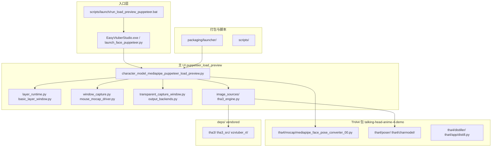
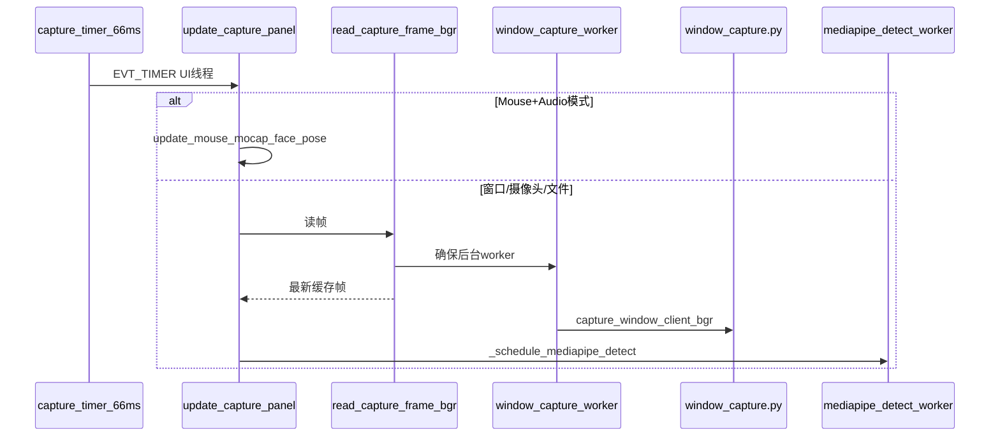

# EasyVtuberStudio develop — 代码地图

> **编制方式**：以 CodeGraph 索引为核心（`codegraph status` / `files` / `context` / `callers` / `callees` / `impact`），辅以仓库既有文档。  
> **索引根**：`e:\easyvtuberstudio-develop`（**勿**用工作区根 `E:\`）。  
> **编制日期**：2026-06-15  
> **索引快照**：504 files · 10,125 nodes · 22,391 edges · DB ~23 MB（`codegraph status`）

本图回答三件事：**仓库分区干什么**、**从哪进**、**改一条链路会牵动谁**。函数级 UI 对照见同目录实验下的 [CUSTOM_FUNCTION_INDEX.md](../face-puppeteer-ui-enhancements-ai-code/experiments/puppeteer_load_preview/CUSTOM_FUNCTION_INDEX.md)。

---

## 1. 如何用 CodeGraph 查本仓

### 1.1 MCP（Cursor 内，优先）

| 场景 | MCP | 索引根 |
|------|-----|--------|
| 日常 develop | `codegraph` | `e:\easyvtuberstudio-develop` |
| push 审查 / main 对照 | `codegraph-fork` | `e:\easyvtuberstudio-main` |

| 意图 | 工具 |
|------|------|
| 模块职责 / 改功能从哪入手 | `codegraph_context` |
| A 如何调用到 B | `codegraph_trace` |
| 按名称找符号 | `codegraph_search` |
| 谁调用 X / X 调用谁 | `codegraph_callers` / `codegraph_callees` |
| 改 X 前看影响面 | `codegraph_impact` |
| 项目文件结构（勿 Glob 扫盘） | `codegraph_files` |
| 索引是否过期 | `codegraph_status` |

配置见 `E:\.cursor\mcp.json`；空闲 30 分钟自动停服见 `E:\.cursor\codegraph\` 生命周期 hook。

### 1.2 CLI（MCP 未挂载时的等价命令）

```bat
codegraph status e:\easyvtuberstudio-develop
codegraph sync e:\easyvtuberstudio-develop
codegraph files -p e:\easyvtuberstudio-develop --filter experiments/puppeteer_load_preview --format flat
codegraph context -p e:\easyvtuberstudio-develop "描述你要改的功能"
codegraph query -p e:\easyvtuberstudio-develop "符号名"
codegraph callers -p e:\easyvtuberstudio-develop "update_capture_panel"
codegraph callees -p e:\easyvtuberstudio-develop "update_capture_panel"
codegraph impact -p e:\easyvtuberstudio-develop "read_capture_frame_bgr"
```

### 1.3 索引范围与排除

当前索引 **504 个 Python/YAML 文件**，**未包含** `addons/*/venv`、`site-packages`、`.git`（体量过大且非项目源码）。  
大改动 / main 覆盖 develop / 批量改文件后须手动：

```bat
codegraph sync e:\easyvtuberstudio-develop
```

---

## 2. 仓库分区（develop）



| 分区 | 路径 | 职责 | 索引规模（约） |
|------|------|------|----------------|
| **主 UI 实验** | `face-puppeteer-ui-enhancements-ai-code/experiments/puppeteer_load_preview/` | 面捕演播主程序：wx UI、捕获、推理调度、图层、透明输出、持久化 | 40 文件 · 主文件 **650 symbols** |
| **THA4 上游包** | `face-puppeteer-ui-enhancements-ai-code/talking-head-anime-4-demo/src/tha4/` | Student 推理、面捕转换、训练/蒸馏、旧版 demo app | 159 文件 |
| **镜像 src/** | `src/tha4/`（与 demo 包并行路径） | 与 demo 包同构的 THA4 源码副本，索引中两套路径均存在 | 与上类似 |
| **THA3 黑盒** | `deps/tha3/`（`tha3_src/`、`tha3/`、`ezvtuber_rt/`） | THA3 ONNX 立绘推理、上游 EasyVtuber 运行时（TRT/ORT 参考实现） | 大量 vendored |
| **示例模型** | `data/character_models/` | 内置 bai student 等 | 少量 |
| **打包** | `packaging/` | PyInstaller 启动器、THA4Train 入口、运行时探测 | 4 文件 |
| **维护脚本** | `scripts/` | 摄像头探测、双仓同步、验收 | 1+ 文件（索引内） |
| **运行时数据** | `workspace/` | 本地：venv/日志/engines；**入库种子**：`load_preview_ui_state.json`、`basic_layers/`、`region_wobble_mask*.png` | — |
| **可选包** | `addons/` | 面捕 venv、THA3 权重、THA4 训练（**venv 已排除索引**） | — |

---

## 3. 入口点清单

| 类型 | 路径 | 说明 |
|------|------|------|
| **主 UI** | `experiments/puppeteer_load_preview/character_model_mediapipe_puppeteer_load_preview.py` | `MainFrame` + ULW `TransparentCaptureWindow` + `ControlsFrame`；日常开发主入口 |
| **OpenSeeFace** | `openseeface_mocap_driver.py`、`openseeface_runtime.py` | UDP 面捕、pacer、眼部 motion 管线 |
| **启动器** | `packaging/launcher/launch_face_puppeteer.py` | 打包 exe 调用的 Python 入口 |
| **训练入口** | `packaging/launcher/launch_tha4train.py` | DEPLOY [5] THA4 训练工具 |
| **批处理** | `scripts/launch/run_load_preview_puppeteer.bat` | develop 一键启动（见 HANDOVER） |
| **探测** | `packaging/probe_mouse_student_runtime.py` | Mouse+Student 最小路径探测 |
| **探测** | `scripts/probe_cameras.py` | 摄像头枚举 |
| **图像源工厂** | `image_sources/factory.py` → `create_image_source` | THA4 Student / THA3 并列切换 |
| **冒烟测试** | `smoke_*.py`（含 OSF / 图层 / 鼠标面捕 / 透明窗等） | 局部回归 |

---

## 4. 模块职责表（puppeteer_load_preview）

| 模块 | 文件 | 职责 |
|------|------|------|
| **God Object 主壳** | `character_model_mediapipe_puppeteer_load_preview.py` | UI 框架、定时器、推理 worker、输出 present、持久化、校准 |
| **图层运行时** | `layer_runtime.py` | 五层槽位、资产缓存、`draw_post_process_stack`、GIF/PNG 加载 |
| **图层子窗** | `basic_layer_window.py` | 图层编辑 UI |
| **numpy 合成** | `numpy_layer_compositor.py` | P5 接口：纯 numpy 全栈合成（采集热路径复用显示结果） |
| **透明采集窗** | `transparent_capture_window.py` | ULW 真透明 + 色键代理窗 |
| **输出后端** | `output_backends.py` | 真透 / 色键 / Spout2 占位 |
| **窗口捕获** | `window_capture.py` | PrintWindow / BitBlt 抓 Win32 窗口 |
| **鼠标面捕** | `mouse_mocap_driver.py` | EasyVtuber 风格鼠标+音频 |
| **中心区 UI** | `mouse_zone_panel.py` | 屏幕/中心区示意图 |
| **姿态插帧** | `frame_interpolation.py` | pose-space lerp + 真实 `poser.pose()` |
| **THA3 引擎** | `tha3_engine.py` | ONNX DirectML 立绘黑盒 |
| **THA3 源** | `image_sources/tha3_source.py` | THA3 图像源适配 `ImageSource` 协议 |
| **THA4 源** | `image_sources/tha4_student_source.py` | Student 模型加载与 tick |
| **便携路径** | `portable_paths.py` | workspace 状态、legacy 迁移 |
| **上游资产** | `upstream_assets.py` | THA3/THA4 权重探测 |
| **函数索引生成** | `_gen_function_index.py` | 生成 `CUSTOM_FUNCTION_INDEX.md` |

**主文件内嵌类（拆分候选簇）**：

| 类 | 行号约 | 簇 |
|----|--------|-----|
| `OutputFrame` | 681 | 输出窗拖动、图层编辑手势 |
| `ControlsFrame` | 791 | 完整调参窗壳 |
| `WebcamPreviewPopupFrame` | 835 | 摄像头弹窗 |
| `MainFrame` | 914 | 其余几乎全部逻辑 |

---

## 5. 关键调用链（CodeGraph 验证）

### 5.1 捕获链



**CodeGraph `callees(update_capture_panel)`**（主文件路径）：

- `is_mouse_audio_mocap_mode` → `update_mouse_mocap_face_pose`
- `read_capture_frame_bgr` → `is_acceptable_capture_frame`
- `update_capture_preview_bitmap`
- `should_process_mediapipe` → `ensure_face_landmarker` → `_schedule_mediapipe_detect`
- `schedule_active_capture_timer` / `schedule_idle_capture_timer`

**`impact(read_capture_frame_bgr)`**：仅牵动 `MainFrame` 内 5 个符号（含 `update_capture_panel`、窗口源切换 handler）。

> **注**：`capture_window_client_bgr` 经模块属性调用，索引中 **无直接 callers 边**；实际调用在 `_window_capture_worker`。

### 5.2 鼠标面捕链

**`callees(update_mouse_mocap_face_pose)`**：

- `mouse_mocap_driver.build_mouse_mediapipe_face_pose`
- `MainFrame._update_mouse_dynamic_enhancement_motion`
- `mediapipe_face_pose_converter_00.refresh_audio_input_runtime`

### 5.3 推理 / 显示链

| 阶段 | 符号 | 文件 |
|------|------|------|
| 图像源 tick | `Tha4StudentSource.tick` / `Tha3Source.tick` | `image_sources/` |
| 姿态 → 推理 | `poser.pose()`（经 image source） | THA4 Student |
| 呈现 | `_present_character_bitmap` | 主文件 ~9106 |
| 合成 | `_compose_present_rgba` → `draw_post_process_stack` | 主文件 + `layer_runtime.py` |
| 缓存重绘 | `draw_cached_result_image` | 主文件 ~8952 |
| 透明采集 | `_push_transparent_capture_stack_sync` | 主文件 → `transparent_capture_window.py` |

**`callees(_present_character_bitmap)`**（部分）：

- `_compose_present_rgba`
- `wx_bitmap_to_rgba_array` / `sanitize_rgba_alpha_fringe`
- `get_output_background_signature`
- `is_ulw_output_enabled`

### 5.4 图层合成链

**`callees(draw_post_process_stack)`**（`layer_runtime.py`）：

- `resolve_layer_rects`
- `layer_at_stack_position`
- `draw_layer_on_dc`

并行 numpy 路径：`numpy_layer_compositor.compose_full_stack_rgba`（P5 预留，采集热路径当前复用显示合成结果）。

### 5.5 THA3 立绘链

**`Tha3Source.tick`** → `mediapipe_pose_to_tha3_vector` → `Tha3Engine.render_pose` → `MainFrame.draw_cached_result_image`。

上游 vendored TRT 参考：`deps/tha3/ezvtuber_rt/ezvtb_rt/{core_trt,tha3,tha4_student}.py`（本项目主链未接 TensorRT）。

---

## 6. 热点与复杂度标注

| 热点 | 指标 | 说明 |
|------|------|------|
| **主 UI 单文件** | ~8720 行 · **650 symbols** | 最大技术债；`impact(MainFrame)` 牵动 **751** 个符号（含历史 demo 副本） |
| **图层运行时** | 2049 行 · 232 symbols | 第二大脑；与主文件双向耦合 |
| **透明采集** | 904 行 · 123 symbols | 双窗 + ULW；plans 标「顽固掉帧」 |
| **MediaPipe 转换器** | `mediapipe_face_pose_converter_00.py` | 呼吸/嘴型/朝向校准；被主文件与鼠标面捕共用 |
| **重复路径** | `src/tha4/` 与 `talking-head-anime-4-demo/src/tha4/` | 索引中两套 `MainFrame`/`update_capture_panel` 并存，查符号时认准 **puppeteer_load_preview** 路径 |

**主文件内建议拆分边界**（按调用簇，非实施承诺）：

1. **CapturePipeline** — `update_capture_panel`、`read_capture_frame_bgr`、MediaPipe/窗口 worker  
2. **OutputPipeline** — `_present_character_bitmap`、透明采集、output backends  
3. **Persistence** — `load_preview_ui_state.json` 读写、legacy 迁移  
4. **Controls/UI** — `ControlsFrame` 构建、校准按钮路由  

---

## 7. 与 CUSTOM_FUNCTION_INDEX 的关系

| 文档 | 粒度 | 何时读 |
|------|------|--------|
| **本文件 CODEBASE_MAP** | 仓库分区、模块、调用链、热点 | 新 Agent 上手、改跨模块功能、评估影响面 |
| **CUSTOM_FUNCTION_INDEX** | 单文件内 custom 函数 ↔ UI 控件 | 改按钮/校准/定时器、防回归 |
| **条目设计手册** | 产品需求 `f-###` / `UI-A##` | 改功能前对需求 |

大重构后：

```powershell
codegraph sync e:\easyvtuberstudio-develop
python face-puppeteer-ui-enhancements-ai-code/experiments/puppeteer_load_preview/_gen_function_index.py
```

---

## 8. 常用 CodeGraph 查询示例

```bat
REM 改窗口捕获前
codegraph impact -p e:\easyvtuberstudio-develop read_capture_frame_bgr
codegraph callees -p e:\easyvtuberstudio-develop update_capture_panel

REM 改图层合成前
codegraph context -p e:\easyvtuberstudio-develop "图层合成 draw_post_process_stack 与透明采集"

REM 找主入口
codegraph query -p e:\easyvtuberstudio-develop MainFrame
codegraph files -p e:\easyvtuberstudio-develop --filter puppeteer_load_preview --format flat

REM 改鼠标面捕前
codegraph callees -p e:\easyvtuberstudio-develop update_mouse_mocap_face_pose
```

---

## 9. 延伸阅读

| 文档 | 路径 |
|------|------|
| 交接主入口 | [HANDOVER.md](HANDOVER.md) |
| 图层计划 | [../plans/layer-runtime-replan_3a393fc1.plan.md](../plans/layer-runtime-replan_3a393fc1.plan.md) |
| THA3 集成 | [../face-puppeteer-ui-enhancements-ai-code/experiments/puppeteer_load_preview/THA3_INTEGRATION.md](../face-puppeteer-ui-enhancements-ai-code/experiments/puppeteer_load_preview/THA3_INTEGRATION.md) |
| 函数级索引 | [../face-puppeteer-ui-enhancements-ai-code/experiments/puppeteer_load_preview/CUSTOM_FUNCTION_INDEX.md](../face-puppeteer-ui-enhancements-ai-code/experiments/puppeteer_load_preview/CUSTOM_FUNCTION_INDEX.md) |
| 产品设计条目 | `e:\record\easyvtuberstudio-index.json` |

---

*地图结束 · 索引变更后请 `codegraph sync` 并更新本文「索引快照」日期*
