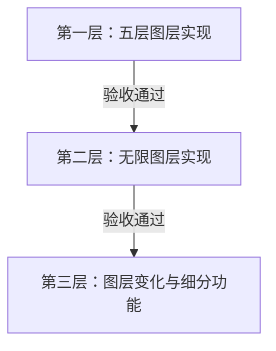
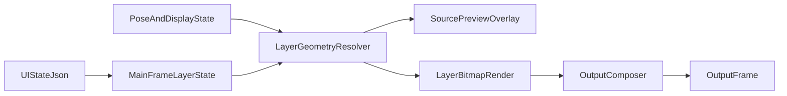

# 多图层直播工具重排计划

## 交接摘要
这是一个面向直播现场的轻量工具方案，不是完整创作平台。新 agent 接手时，必须先按下面的口径理解需求，再继续实现：
- 核心目标是临时舞台效果与临场调整便捷性
- 不要把方案往完整 3D/Live2D 制作工具、状态机平台或互动平台方向发散
- 当前代码里没有现成图层系统，必须先建统一运行时图层状态，不能假设项目里已有多层结构
- 当前最稳的主接入点是 `MainFrame`、`source_image_panel`、`draw_result_wx_image()` 和 UI JSON 持久化，而不是先改 THA4 底层推理链
- **角色 RGBA 帧** 来自可切换黑盒：`tha4_student` 或 `tha3`（见 `experiments/puppeteer_load_preview/THA3_INTEGRATION.md`）；图层合成只接外壳输出，不接 THA3/THA4 推理链
- 预览和最终输出必须共用同一套图层几何求值结果，避免“预览正确、输出不对”或反过来
- 新交互设计默认优先采用触摸屏逻辑：点击、拖拽、大手柄、明确模式切换，尽量少依赖悬停、右键和精细小目标

## 已确认的硬规则
- 同时支持基础 5 层模式与不限层模式
- 基础 5 层与不限层必须共享同一套图层求值逻辑，只是 UI 能力和容量不同
- 父子绑定与运动锁定最大嵌套深度为 3，且必须逐级选择
- 需要阻止循环依赖，包括父子绑定、运动锁定和透视角点锁定叠加形成的环
- 不限层模式支持真实图层组
- 默认 5 层模式没有“组”的概念，所有组相关能力都只对不限层模式生效
- 图层组不设置子项数量上限
- 用户第一次打开不限层模式时，必须明确警告“不限层对电脑性能挑战较大”
- 用户第一次把任何滑块条调到顶端时，必须警告“所有滑块条上下限均会超出合理区间，谨慎调整参数”
- 交互原则整体倾向触摸屏逻辑：优先单击、拖动、明显可触控目标和低误触状态切换
- 只要当前存在选中项，就支持上下左右按键做像素级移动
- 不限层模式支持 `Shift` 区间选中和 `Ctrl` 增减选中
- “将...对齐...”只对单选生效；多选时改为基于临时整体包围框做整体位置语义
- 不限层模式需要单独打开一个“加载了全部图层的角色立绘调整窗口”，并带有调整区
- 不限层模式下，只有在图层列表中选中了图层或图层组，才能拖动对应素材进行调整
- 不限层模式下，若未选中任何素材/组就点击立绘预览，需要在预览下方用文字提示“请先选中素材”
- 不限层模式下，未选中任何素材时，拖动手势解释为移动或缩放预览框，而不是编辑素材
- 不限层模式下，单选素材时允许调整素材缩放；多选时禁止素材缩放
- `Ctrl` 形成的非连续选区只能批量删除，不能批量移动
- 不限层模式的顺序按钮要支持左键连击命中锁定
- 图层和图层组都支持显隐规则：按键切换、按住才隐藏、按住才显示、间隔周期
- 图层显示/隐藏除了本地自定义按钮外，还要预留外部接入口
- 面部输入/模型参数输入也要预留外部接入口
- 打包保存会复制素材到目标目录下的 `addons`，并可能去重或改名，必须明确警告用户
- 基础 5 层模式的存储有自己的独立文件夹结构，且每个素材使用单独文件
- 新增透视变形时，采用“手动四角 + 每角可锁锚点”的混合模型，并且基础 5 层和不限层都支持
- 锁定目标不仅要支持“另一个图层整体锚点”，还要支持“另一个图层的透视角点/透视点”
- 取消持续性竖中轴吸附，改为选中素材后可一键对齐竖中心；不扩展为横向或全方向自动吸附系统
- 需要提供“将...对齐...”按钮，可把当前图片的 9 个参考点之一对齐到锁定锚点的绝对值位置
- 图层素材源除了静态图和 GIF，还要支持本地视频文件、摄像头以及窗口/屏幕区域捕获
- 视频图层首版不追求复杂播放控制，而是要像普通图层一样参与透视、简单运动、绑定和遮挡求值
- 本地视频文件需要支持 5 种播放模式：全局只播放一次、显现时单次播放、仅显现时播放、显现开始且隐藏不中断、自动循环播放
- 外部接口预留采用 WebSocket；主程序只做到接口生成与本地接收边界，完整互动逻辑放到其他独立项目实现
- 需要提供一个按钮，用于批量为当前选中图层生成外部接口
- 点击批量生成外部接口按钮时，要先警告“操作不可逆”，但用户后续仍可手动删除已生成接口
- 生成的接口命名默认使用项目素材名或组名
- 用户可在“后处理和其他”区域选择是否启用“传入模型参数的外部接口”
- 模型参数外部接口直接采用参数的 value 名字命名
- 打包保存不只是复制素材，还要按组关系整理目录，并在每个文件夹内写独立素材状态记录文件
- 每次加载都必须检查死循环嵌套与失效锁定对象：有死循环则拒绝加载；锁定失效则清空对应锁定并做简单文字提示

## 明确不作为当前目标
- 不把本工具定义成完整创作工具链
- 不引入复杂人体局部遮挡；首版只做角色前/后两类遮挡
- 不把需求扩大到互动系统、观众触发、复杂外部事件编排
- 不优先修改 THA4 底层网络推理逻辑，除非脚本级渲染链无法满足目标
- 不在首版透视里加入边约束、面约束、自动保持平行、复杂物理或关键帧动画
- 不把视频图层首版做成完整播放器，不优先加入时间线、复杂传输控制或网络流支持
- 不在本项目里继续开发完整互动中控、平台接入或跨项目编排逻辑；这些放到其他独立项目
- 不在本项目里继续开发复杂的外部参数编排逻辑；这里只预留 WebSocket 参数输入边界

## 当前代码现实
新 agent 接手时，最容易误判的一点是：原计划里描述的是未来目标，但当前代码现实仍然很“单层”。
- 只有整模型级别运行时状态，没有图层级状态模型
- `source_image_panel` 当前只画原始立绘，不画图层叠加
- `draw_result_wx_image()` 当前只做整图平移/缩放/旋转合成
- `load_persistent_ui_state()` / `collect_persistent_ui_state()` / `apply_persistent_ui_state()` 当前只保存整工具 UI 状态，但这是最自然的首版图层持久化入口
- 右侧栏入口已经存在：`create_postprocess_panel()` 适合扩成基础 5 层模式 UI

## 外挂图层输出（第零层，2026-05-27 已落地开关与桥接预留）

目标：避免「内置输出窗 + 外挂合成窗」双预览抢操作；THA4 只负责角色渲染与调参，最终合成与 OBS 采集由外挂进程完成。

已实现：

- `create_postprocess_panel()` 增加勾选：**向外挂图层系统输出（隐藏内置输出窗）**
- 持久化字段：`external_layer_output_enabled`
- 勾选 ON：`OutputFrame.Show(False)`；`ensure_output_frame()` / `raise_output_frame()` 不再弹出内置窗
- 模块 `experiments/puppeteer_load_preview/external_layer_output_bridge.py`
  - `external_layer_output/contract.json`：画布尺寸与格式约定
  - `external_layer_output/status.json`：每帧元数据（`frame_sequence`、display transform、背景色等）
- `draw_result_wx_image()` 在外挂模式下调用 `publish_composite_frame()`（当前仅元数据，无像素文件）

未做（留给 L0 后续 todo 或 L1 合成后）：

- `status.json` 中的 `frame_rgba_path` 实际写入
- `layer_state_path` 与图层状态模型联动
- 外挂进程心跳检测与「未连接外挂」UI 警告

验收（第零层）：

1. 勾选后重启，内置 **THA4 Output / 输出** 窗不再出现。
2. 取消勾选后，内置输出窗恢复且位置/尺寸可从 `output_frame_*` 恢复。
3. 加载模型后 `external_layer_output/status.json` 的 `frame_sequence` 递增。
4. HANDOVER §7 与本文档 L0 todo 可作为外挂开发对接说明。

## 三层实施节奏（进度控制）

为避免进展过快失去控制，全部实现 todo 已拆为三层。**必须逐层验收通过后再进入下一层**；未通过当前层验收门（`L1-acceptance-gate` / `L2-acceptance-gate`）前，不启动下一层的 UI 入口或用户可见开关。

### 第一层：五层图层实现
目标：在**不打开不限层**的前提下，形成可日常使用的五层直播叠加闭环。

包含：
- `basic_layers_state` 与五层槽位
- 最小几何求值（位置、缩放、z_order、基础显隐）
- 静态图输出合成 + 预览选中/拖动/缩放
- `postprocess_panel` 五层卡片（路径、简单显隐、删移、缩放）
- 五层独立目录与每素材单独状态文件

本层明确不做：
- 不限层窗口、图层组、Shift/Ctrl 多选
- 透视、GIF/视频、复杂显隐规则、WebSocket、按组打包

与本层并行（不阻塞 L1 验收）：
- 外挂输出开关与 bridge 元数据（见上文「外挂图层输出」）；L1 静态合成接入后，再补 `frame_rgba_path` 与 `layer_state_path`

验收标准：
- 五层模式可独立完成：加载素材 → 预览调整 → 输出可见 → 保存/加载恢复
- 切换回五层后无“组/多选/不限层”残留 UI 或状态

### 第二层：无限图层实现
目标：在五层闭环稳定后，再开放不限层容量与组织能力。

包含：
- `advanced_layers_state`、不限层窗口、调整区窗口
- 图层组（无子上限）、Shift/Ctrl 多选、顺序按钮连击锁定
- 按组目录打包保存、文件夹 manifest、额外文件导入
- 首次进入不限层性能警告（一次性）

本层明确不做：
- 透视 warping、GIF/视频源、复杂显隐模式、外部 WebSocket、加载环路校验（留给第三层）

验收标准：
- 不限层可独立完成：模式切换 → 组/多选/调整区可用 → 按组打包/加载
- 五层模式仍保持第一层行为不变

### 第三层：图层变化与细分功能实现
目标：在两层模式都稳定后，再补“会改变图层形态/行为”的高级能力。

包含：
- 绑定、运动锁定、透视角点锁定、深度/环路校验
- GIF、抠图、视频源与 5 种本地视频播放模式
- 四角透视、对齐按钮、像素级移动、复杂显隐规则
- WebSocket 外部接口（图层显隐 + 模型参数输入）
- 加载校验、批量抠图、性能与文档收尾

验收标准：
- 五层与不限层**共用同一套求值逻辑**，高级能力通过开关/字段启用，不造成模式行为分叉
- 预览与输出对透视/GIF/显隐/视频结果一致

## 新 agent 上手顺序
如果换一个新 agent 继续实现，建议严格按这个阅读/动手顺序进入：
1. 先读 [E:\\tha4fork-develop\\face-puppeteer-ui-enhancements-ai-code\\experiments\\puppeteer_load_preview\\character_model_mediapipe_puppeteer_load_preview.py](E:\\tha4fork-develop\\face-puppeteer-ui-enhancements-ai-code\\experiments\\puppeteer_load_preview\\character_model_mediapipe_puppeteer_load_preview.py) 中的：
   - `create_postprocess_panel()`
   - `update_source_image_bitmap()` / `paint_source_image_panel()`
   - `draw_result_wx_image()`
   - `update_result_image_bitmap()`
   - `load_persistent_ui_state()` / `collect_persistent_ui_state()` / `apply_persistent_ui_state()`
2. 再确认这份计划里的“统一数据模型”和“硬规则”
3. 确认当前应处于哪一层（默认从第一层五层开始），只执行该层 todo
4. 第一层：运行时状态骨架（basic）→ 最小几何求值 → 输出链 → 五层预览与卡片 → 验收门
5. 第二层：advanced 状态 → 不限层窗口/调整区 → 组/多选/按组打包 → 验收门
6. 第三层：绑定/透视/视频/显隐规则/WebSocket/加载校验等细分功能

## 关键名词解释
- `basic_layers_state`：基础 5 层模式的图层状态视图
- `advanced_layers_state`：不限层模式的图层状态视图
- `basic_mode_folder_manifest`：基础 5 层模式自己的目录状态记录，描述固定槽位与各素材单独文件
- `group_folder_manifest`：某个素材文件夹内的独立状态记录文件，记录该文件夹下素材与分组/引用关系
- `LayerGeometryResolver`：统一求每层最终矩形/四边形的逻辑层，供预览和输出共用
- `resolved_quad`：透视、绑定、运动、缩放都应用后的最终四边形结果
- `behind_character` / `in_front_of_character`：首版仅支持的两类遮挡区间
- `perspective_corner_locks`：四个角分别锁定角色锚点或其他图层锚点的配置
- `other_layer_perspective_point`：其他图层求值完成后的透视点位，例如四角点、中心点或后续扩展点
- `video_source_layer`：以本地视频、摄像头或窗口捕获作为持续帧输入的图层

## 已确认范围
本轮需求已经收敛为一个面向直播现场的轻量工具，核心不是完整创作链，而是：
- 基础 5 层模式 + 不限层模式
- 图层父子绑定与运动锁定，最大嵌套深度 3，且必须逐级选择
- 图层组、显隐规则、批量整理、打包保存
- 图层组仅存在于不限层模式，且不设子项数量上限
- GIF、单色抠图、周期运动
- 本地视频文件、摄像头与窗口捕获图层
- 新增简单透视变形：四角透视 + 角点锁定，基础 5 层与不限层都支持

## 结合项目现状后的判断
当前代码基础集中在 [E:\tha4fork-develop\face-puppeteer-ui-enhancements-ai-code\experiments\puppeteer_load_preview\character_model_mediapipe_puppeteer_load_preview.py](E:\tha4fork-develop\face-puppeteer-ui-enhancements-ai-code\experiments\puppeteer_load_preview\character_model_mediapipe_puppeteer_load_preview.py)，但真实现状和之前抽象计划有一个关键差异：
- 目前只有整模型级别的运行时状态，没有现成的图层状态模型
- `source_image_panel` 现在只画原始立绘，尚未承担图层叠加编辑
- `draw_result_wx_image()` 现在只做整图缩放/旋转/平移，是最终合成入口，但还没有图层级合成链
- `load_persistent_ui_state()` / `collect_persistent_ui_state()` / `apply_persistent_ui_state()` 已可作为首版图层持久化入口

因此，计划需要从“先摆 UI”重排为“先建立统一图层状态和合成几何链，再挂 UI”。

## 关键接入点
主要变更文件：
- [E:\tha4fork-develop\face-puppeteer-ui-enhancements-ai-code\experiments\puppeteer_load_preview\character_model_mediapipe_puppeteer_load_preview.py](E:\tha4fork-develop\face-puppeteer-ui-enhancements-ai-code\experiments\puppeteer_load_preview\character_model_mediapipe_puppeteer_load_preview.py)
- [E:\tha4fork-develop\face-puppeteer-ui-enhancements-ai-code\experiments\puppeteer_load_preview\README.txt](E:\tha4fork-develop\face-puppeteer-ui-enhancements-ai-code\experiments\puppeteer_load_preview\README.txt)

优先复用的现有函数：
- `update_source_image_bitmap()` / `paint_source_image_panel()`：立绘预览与图层编辑叠加入口
- `draw_result_wx_image()`：最终输出合成入口
- `update_result_image_bitmap()`：结果刷新入口
- `create_postprocess_panel()`：基础 5 层模式的右侧栏入口
- `load_persistent_ui_state()` / `collect_persistent_ui_state()` / `apply_persistent_ui_state()`：首版状态持久化入口

## 重排后的架构

核心变化：
- 先在 `MainFrame` 内建立统一 `layer_states` / `basic_layers_state` / `advanced_layers_state` 运行时结构
- 再抽出一个统一的 `LayerGeometryResolver`，负责：
  - 绑定目标
  - 父链深度校验
  - 周期运动
  - 显隐规则
  - 透视四角与角点锁定
- 预览区和最终输出都只消费同一份几何求值结果，避免“预览一套、输出一套”

## 统一数据模型
先把所有已确认需求收敛到同一个每层结构里，再决定 UI 如何暴露：
- 基础字段：`id`、`enabled`、`visible`、`asset_path`、`asset_type`、`z_order`
- 素材源字段：`source_type`、`capture_source_kind`、`capture_source_id`、`is_live_source`
- 位置与缩放：`local_x`、`local_y`、`local_scale`
- 对齐字段：`align_to_anchor_point_mode`
- 绑定：`binding_target`、`parent_layer_id`、`inherit_flags`、`nesting_level`
- 周期运动：`motion_enabled`、`motion_template`、`motion_params`、`motion_lock_target`、`motion_lock_mode`
- 显隐：`visibility_mode`、`visibility_hotkey`、`visibility_hold_behavior`、`visibility_period_ms`、`visibility_phase_offset_ms`
- 外部接口：`external_interface_enabled`、`external_interface_name`、`external_interface_transport`
- 模型参数外部输入：`external_model_param_input_enabled`、`external_model_param_transport`
- 抠图：`chroma_enabled`、`chroma_color`、`chroma_tolerance`
- GIF：`frames`、`frame_durations_ms`、`current_frame_index`
- 视频：`video_state`、`current_video_frame`、`last_video_tick_ms`、`video_playback_mode`、`video_started_once`、`video_last_visible_state`
- 透视：`perspective_enabled`、`perspective_quad_local`、`perspective_corner_locks`

不限层模式额外结构：
- `advanced_layer_groups`
- `selected_layer_ids`
- `selection_anchor_layer_id`
- `selection_content_bounds`
- `selection_nine_point_proxy`

打包/加载额外结构：
- `basic_mode_folder_manifest`
- `group_folder_manifests`
- `asset_origin_path`
- `asset_packaged_path`
- `lock_reference_status`

UI 偏好额外结构：
- `advanced_mode_warning_acknowledged`
- `slider_extreme_warning_acknowledged`
- `advanced_adjustment_window_geometry`
- `advanced_preview_hint_text_state`

## 重排后的实施顺序

> **交付节奏以「三层实施节奏」为准。** 下面 1–7 步描述的是技术依赖顺序；实际动手时，第一层只做五层相关子集，第二层再引入 `advanced_layers_state` 与不限层 UI，第三层再补 GIF/透视/复杂显隐/WebSocket 等细分能力。

### 1. 先落运行时图层状态骨架（第一层先落 `basic_layers_state`；`advanced_layers_state` 延至第二层）
在 [E:\tha4fork-develop\face-puppeteer-ui-enhancements-ai-code\experiments\puppeteer_load_preview\character_model_mediapipe_puppeteer_load_preview.py](E:\tha4fork-develop\face-puppeteer-ui-enhancements-ai-code\experiments\puppeteer_load_preview\character_model_mediapipe_puppeteer_load_preview.py) 中先建立：
- `basic_layers_state`
- `advanced_layers_state`
- 当前模式切换字段
- 图层默认值构造器，以及仅不限层模式使用的图层组默认值构造器
- UI JSON 读写扩展

这一步完成后，后续所有功能都能挂在统一状态上，不需要边做边返工数据结构。

### 2. 提前抽出统一几何求值链
在 UI 之前先补一条“图层求值”链，统一产出每层最终矩形/四边形：
- 当前素材帧输入（静态图 / GIF / 视频）
- 基础位置与缩放
- 父子绑定
- 一键对齐竖中心
- 九点参考对齐到锁定锚点绝对位置
- 周期运动
- 显隐结果
- 透视四角求值

新增简单透视时，采用：
- 四角手动编辑
- 四角分别可锁定到角色部位锚点、其他图层整体锚点，或其他图层求值完成后的透视点
- 继续复用最大 3 层深度和环路校验

首版透视 warping 优先走 Pillow 路径，而不是直接依赖 `wx.GraphicsContext`。

### 3. 先把最终输出合成链打通
在 `draw_result_wx_image()` 前后插入图层合成流程，先确保：
- 静态图片层可叠加
- 本地视频、摄像头和窗口捕获可作为动态图层叠加
- `behind_character` / `in_front_of_character` 两类遮挡生效
- GIF、抠图、显隐、透视都能在最终输出看到

原因是：如果输出链不先成立，后面的 UI 编辑很难验证真假一致性。

### 4. 再做立绘预览区编辑能力
扩展 `source_image_panel`：
- 先实现选中、拖动、缩放
- 再实现四角透视编辑态
- 预览只做图层编辑，不占用 `OutputFrame` 的拖窗手势

这样可以避开当前 `OutputFrame` 左键拖动整窗的现有行为冲突。

触摸屏优先的交互原则：
- 手柄、角点、缩放控件和拖拽热区要偏大，避免只能靠鼠标精确命中
- 关键操作优先依赖单击、拖拽和显式按钮，不把悬停态作为必要前提
- 不把右键菜单设为核心路径；即使保留，也只能作为补充入口
- 交互模式切换要明显可见，例如“当前在移动素材 / 当前在调整预览框 / 当前在透视编辑”
- 多选、组选中、未选中提示等状态，必须通过持续可见的文字或高亮反馈明确表达
- 鼠标和触摸板仍可使用，但默认设计标准按“手指/触控笔也能顺利操作”来约束
- 同时保留键盘精调路径：当存在选中项时，可用上下左右按键进行像素级微调

不限层模式的独立立绘调整窗口规则：
- 进入不限层模式后，除了图层列表窗口外，再单独打开一个“加载了全部图层的角色立绘调整窗口”
- 该窗口用于查看所有图层叠加后的角色立绘，并包含调整区/提示区
- 这个窗口中的预览只服务于不限层模式，不与基础 5 层模式的固定编辑区混用
- 点击或拖动预览前，优先依据当前列表选中状态决定手势语义

### 5. 再接基础 5 层模式 UI
在 `create_postprocess_panel()` 扩出基础 5 层卡片，卡片中逐步加入：
- 预览框
- 路径按钮
- 素材源类型与来源摘要
- 上下移
- 删除
- 绑定选择
- 缩放
- 一键对齐竖中心按钮
- “将...对齐...”按钮与 9 点选择
- 抠图
- 周期运动
- 显隐
- 透视折叠区

基础 5 层模式先保证单层编辑流畅，不急着一开始就塞满所有复杂控件。

滑块极值首次告警规则：
- 适用于所有滑块条，而不是某一个具体参数
- 当用户第一次把任意滑块拖到顶端时，弹出一次全局提示
- 提示文案固定为：“所有滑块条上下限均会超出合理区间，谨慎调整参数”
- 用户确认后记录到 UI 状态，下次默认不重复弹出
- 该提示是全局参数风险提示，不区分基础 5 层模式或不限层模式

### 6. 再做不限层窗口和高级交互
在基础模式跑通后，再加不限层窗口：
- 图层列表
- 图层组
- 图层组不限制子项数量
- 首次进入不限层模式时弹出性能警告，提醒用户该模式对电脑性能挑战较大
- Shift/Ctrl 多选
- 非连续选区只能批量删除
- 顺序按钮连击命中锁定
- 组显隐与批量操作

这一步尽量复用基础 5 层模式已经稳定的单层编辑控件和求值链。

不限层模式的选择与调整联动规则：
- 只有当图层列表中存在当前选中项时，预览区才进入“编辑素材”语义
- 选中项可以是：
  - 单一图层
  - 单一图层组
  - 通过 `Ctrl` / `Shift` 形成的多选图层集合
- 若当前未选中任何图层或图层组，则点击立绘预览不应直接编辑素材，而是在预览下方显示“请先选中素材”之类的提示文本
- 若当前未选中任何项，则拖动手势解释为移动预览框；缩放手势解释为缩放预览框
- 若单选单一素材，则允许对该素材执行拖动和缩放
- 若选中的是组，或选中的是多个素材，则允许整体位置调整，但不允许对素材执行缩放
- 若当前存在选中项，则支持用上下左右按键做像素级移动：
  - 单选素材时，微调该素材位置
  - 组选中或多选时，整体微调当前选中集合，并保持内部相对位置不变
- 当面对多选素材时，需要构建一个临时整体包围框：
  - 以所有“仍有有效内容像素”的素材为基础计算外接矩形
  - 被单色去背景去掉的内容不计入这个临时框
  - 基于这个临时框生成临时九点参考
  - 后续整体移动语义把多选集合视作一个个体
- 多选时需要在调整区显示当前选中信息摘要，包括：
  - 组名（若当前是组选中或选择集合包含组上下文）
  - 当前素材名
  - 选中素材名列表
- `Ctrl` 和 `Shift` 多选都应触发相同的多选摘要展示逻辑

对齐与吸附规则：
- 不做持续性的竖向中轴吸附，不做横向中轴吸附、不做自由参考线吸附、不做九宫格自动磁吸
- “一键对齐竖中心”是显式动作按钮，只在当前单选素材时生效
- 执行后，把当前素材的竖向中心线对齐到当前锁定锚点的绝对 x 位置
- “将...对齐...”是显式动作按钮，不是拖拽过程中的自动吸附
- “将...对齐...”只对单选生效，不对多选直接执行
- 执行“将...对齐...”时，用户可选择当前图片的 9 个参考点之一：
  - 左上
  - 上中
  - 右上
  - 左中
  - 中心
  - 右中
  - 左下
  - 下中
  - 右下
- 选定后，把该参考点对齐到当前锁定锚点的绝对值位置
- 若当前没有可用锁定锚点，则“将...对齐...”按钮不可执行或需明确提示原因

不限层首次进入警告规则：
- 只在用户第一次打开不限层功能时提示
- 提示内容要明确说明：不限层模式在图层多、GIF 多、视频源多时会明显增加性能压力
- 用户确认后记录到 UI 状态，下次默认不重复弹出
- 这条提示属于模式级提示，不应在基础 5 层模式内反复出现

显隐区的外部接口预留规则：
- 在图层显示/隐藏控制区，除了本地按钮和模式设置外，还要提供“批量生成外部接口”按钮
- 该按钮面向当前选中图层集合执行，不要求用户逐个素材单独创建
- 点击后先弹出一次“操作不可逆”警告
- 虽然警告文案如此表述，但系统仍需允许用户后续手动删除已生成接口定义
- 接口生成协议统一采用 WebSocket
- 接口默认命名规则：
  - 单个素材优先使用素材名
  - 组选中优先使用组名
  - 命名冲突时再做稳定去重
- 主程序只负责生成接口定义和预留本地 WebSocket 接收边界，不在本项目里继续实现完整互动程序

模型参数外部接口预留规则：
- 在“后处理和其他”区域增加一个开关，用于决定是否启用“传入模型参数的外部接口”
- 该接口同样采用 WebSocket
- 接口名直接采用模型参数的 value 名字，不额外做素材/组名式命名
- 主程序只负责：
  - 预留本地 WebSocket 接收边界
  - 把收到的参数值映射到模型参数输入
- 不在本项目里继续实现：
  - 直播平台事件接入
  - 外部参数编排规则
  - 跨项目中控逻辑

### 7. 最后补直播工具向的实用增强
最后再接这些高价值但不应阻塞骨架的功能：
- 打包保存与素材路径重写
- 批量自动抠图
- 说明文案与风险提示
- 性能优化、缓存与刷新节流
- README 记录规则、限制和操作语义

打包保存与加载规则补充：
- 基础 5 层模式使用自己的独立文件夹，不复用不限层模式的组目录结构
- 基础 5 层模式中每个素材都有单独文件，槽位关系由基础模式自己的目录状态记录描述
- 不限层模式下按图层组关系整理文件夹结构；基础 5 层模式不使用组目录语义
- 每个文件夹内写独立素材状态记录文件
- 已经处于目标路径下的素材按目录内相对关系记录
- 不在目标路径下的素材，在记录素材状态时允许用原路径替代
- 加载时若文件夹中出现状态文件未列出的额外素材，也要一并加载，行为上等价于“把完整文件夹复制进来就算导入”
- 加载后立即跑一遍关系校验，而不是等用户编辑后才发现问题

### 8. 视频源图层补强
在统一图层链跑通后，再补视频源细节：
- 本地视频文件作为动态图层输入
- 摄像头作为实时图层输入
- 窗口/屏幕区域捕获作为实时图层输入
- 让它们复用同一套：
  - 绑定目标
  - 简单运动
  - 透视四角
  - 前后遮挡
  - 显隐规则

首版不以复杂播放控制为目标，而是保证“能作为图层稳定刷新并参与几何求值”。

本地视频文件的播放模式明确为：
- `play_once_global`：全局只播放一次，图层会话期间不因再次显示而重播
- `play_once_on_show`：每次从隐藏变为显示时，从头播放一次，播完停在末帧
- `play_only_when_visible`：只有显示时才推进播放，隐藏时暂停，恢复显示后继续
- `start_on_show_keep_running`：第一次显示时开始播放，之后即使隐藏也不中断内部播放进度
- `auto_loop`：自动循环播放

说明：
- 这些播放模式只对本地视频文件生效
- 摄像头和窗口/屏幕区域捕获属于实时源，不走上述播放模式，而是持续拉取最新帧
- 所有视频源最终都要复用同一套图层几何求值与遮挡逻辑

### 9. 加载校验与提示规则
每次从配置或素材文件夹加载时，都执行：
- 绑定链检查
- 运动锁定链检查
- 透视角点锁定检查
- 组与子项关系检查

规则：
- 若发现死循环嵌套或循环引用，直接拒绝加载该次配置/目录，并给出拒绝原因
- 若发现锁定对象失效，不拒绝整体加载；而是把对应锁定对象字段清空
- 清空失效锁定时，只做简单文字提示，不做复杂弹窗交互
- 提示内容必须能指出：哪个素材、哪个锁定对象消失

## 为什么这样重排
这次重排的核心原因是：
- 当前项目没有现成图层系统，先建状态与求值链，比先堆 UI 更稳
- 当前输出链只有整图仿射，透视/GIF/显隐都必须先建立单层合成路径
- 当前 `source_image_panel` 和 `draw_result_wx_image()` 已经是最自然的预览/输出入口，应该直接围绕它们扩展，而不是绕到更底层 THA4 结构里
- 对直播工具来说，最重要的是尽快形成“输出一致、临场可调”的闭环，而不是一开始把所有高级功能 UI 一次铺满
- 视频图层在首版应被视为“持续刷新的动态图层”，重点是进入统一图层求值链，而不是单独做一套播放器系统
- 按组关系整理目录并用文件夹内独立状态文件描述素材，是为了让“直接复制整个文件夹”近似等于一次完整导入/迁移
- 基础 5 层模式保留自己的独立目录与单素材文件结构，是为了让固定槽位模式也能稳定迁移、备份和直接复制导入

## 风险重点
- 透视会把矩形编辑升级为四边形编辑，命中测试和非法几何处理要提前设计
- 绑定、运动锁定、角点锁定，以及“锁到别的图层透视点”叠加后，环路与解释性会变复杂
- GIF + 透视 + 抠图叠加后，刷新频率和缓存设计会成为性能关键
- 视频文件、摄像头和窗口捕获都是持续刷新源，需要单独定义帧采样频率、缓存生命周期和掉帧策略
- 基础 5 层与不限层必须共享同一套求值逻辑，否则行为会分叉
- 必须防止组相关状态泄漏到基础 5 层模式；基础模式切换回来后不应出现任何组 UI 或组语义残留
- 若滑块极值告警不做成“只提示一次的全局提示”，会在频繁调参时严重打断体验；若完全不提示，又会让用户误以为极值仍处于合理范围
- 不限层模式里“未选中时拖预览框、已选中时拖素材”的手势语义切换必须足够明确，否则用户会误判自己正在移动什么
- 多选时只允许位置调整、不允许缩放素材，这条限制必须在调整区和交互反馈上清楚体现，否则会让用户误以为缩放失灵
- “一键对齐竖中心”和“将...对齐...”九点对齐都依赖锁定锚点的绝对位置，若锚点求值顺序不稳定，用户会觉得按钮结果不可预测
- 若“一键对齐竖中心”和“将...对齐...”都存在，必须清楚区分两个一次性动作的适用条件与结果，否则用户会误以为按钮无效或位置被自动改回
- 多选临时包围框若把被单色去背景去掉的区域也算进去，会导致九点和整体移动参考明显偏离用户肉眼看到的有效内容
- 若交互控件过小、过度依赖悬停态或右键路径，会违背触摸屏优先原则，导致平板/触控场景下误触率明显上升
- 像素级键盘微调需要和输入焦点管理配合，避免用户在文本输入或路径编辑时误触方向键把素材移走
- 批量生成 WebSocket 接口时，若命名规则不稳定或去重策略不清晰，会导致后续独立项目难以可靠对接
- “操作不可逆”警告与“允许手动删除”这两层语义必须同时写清楚，否则用户会误解功能边界
- 模型参数接口直接采用 value 名字命名时，必须确认名称稳定且可唯一映射，否则外部项目会难以可靠发送参数
- 若实时视频源直接走和静态图相同的同步刷新路径，容易拖慢整个输出链；必须明确“视频帧更新”和“整体重绘”的关系
- `play_once_on_show`、`play_only_when_visible` 和 `start_on_show_keep_running` 需要依赖图层显隐状态变化边沿，必须明确“显现”判定时机，否则行为会不稳定
- 组不设子项上限后，需要注意大组场景下的列表性能、批量操作性能和打包目录膨胀问题
- 基础 5 层模式与不限层模式采用不同目录语义后，必须避免加载逻辑把两套 manifest 解析混淆
- 加载时自动吸收文件夹中“多出来的素材”虽方便，但必须避免把无关文件误识别成图层素材
- 若不限层模式首次进入警告没有做成“只提示一次”，会造成高频打扰；若完全不提示，又容易让用户低估性能压力
- 死循环拒绝加载与失效锁定清空提示，必须在文案上保持简单明确，避免用户不知道是整包失败还是局部修复

## 建议的第一批实现里程碑（对齐三层节奏）

- **第一层里程碑**
  - 里程碑 1.1：`basic_layers_state` + 五层 UI JSON 持久化
  - 里程碑 1.2：最小几何求值 + 静态图输出合成
  - 里程碑 1.3：五层预览编辑 + `postprocess_panel` 卡片
  - 里程碑 1.4：五层独立目录/单素材文件 + **第一层验收门**
- **第二层里程碑**
  - 里程碑 2.1：`advanced_layers_state` + 首次进入不限层警告
  - 里程碑 2.2：不限层窗口 + 调整区 + 多选/连击锁定
  - 里程碑 2.3：图层组 + 按组打包保存 + **第二层验收门**
- **第三层里程碑**
  - 里程碑 3.1：绑定/运动/深度环路校验 + GIF/抠图/视频
  - 里程碑 3.2：透视四角与角点锁定 + 对齐/像素移动
  - 里程碑 3.3：复杂显隐规则 + WebSocket 接口预留 + 加载校验
  - 里程碑 3.4：批量抠图 + 性能与文档收尾