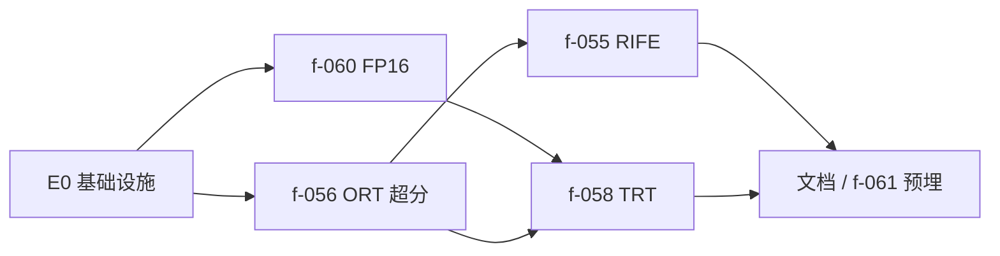

# 输出增强计划：f-055 · f-056 · f-058 · f-060

**手册条目**：`f-055` RIFE · `f-056` 超分 · `f-058` TensorRT · `f-060` FP16  
**设计手册**：`record/easyvtuberstudio条目设计手册.md` §4 · 附录 E  
**索引**：`record/easyvtuberstudio-index.json`  
**立项日期**：2026-06-15

---

## 1. 背景与边界

### 1.1 现状（核对 2026-06-15）

| 能力 | 现状 | 条目 |
|------|------|------|
| 输出平移/缩放/曲线/跟踪 | ✅ `update_display_transform_state` + §9.3 | f-021 ✅ |
| THA3 ∥ THA4 切换 | ✅ `image_sources/` + UI-A05/A06 | f-022 ⊘ |
| 姿态空间插值 | ✅ `frame_interpolation.py` ×2–×4 真 `poser.pose()` | 与 f-055 **互补** |
| THA3 half 变体 | ✅ `separable_half` 等下拉 | f-060 部分 |
| THA4 Student 推理 | PyTorch **FP32** `poser` | f-060 缺口 |
| RIFE / SR / TRT | vendored `deps/tha3/ezvtuber_rt/ezvtb_rt/{core_trt,core_ort}.py`，**主链未接** | f-055/056/058 |

### 1.2 不做什么

- **不**用 `CoreTRT` 整体替换 THA4 Student poser 加载/蒸馏路径（`f-022` 已关闭）。
- **不**移除现有 pose 插值下拉（后处理区已有 output_frame_interpolation）。
- **不**在默认路径引入 TRT 硬依赖；无 TRT = ORT 或纯 PyTorch。
- **不**把 RIFE/SR 权重打进 GitHub ZIP（`dep-001` / `f-057`）。

### 1.3 插入点（固定）

```text
mocap → pose → poser.pose() [可选 FP16]
  → character RGBA + display transform
  → layer compose (numpy)
  → [NEW] EnhancementPipeline: SR / (RIFE 在 present 双缓冲)
  → sanitize / premultiply
  → ULW / OutputFrame
```

上游参考：`CoreORT` / `CoreTRT`（`deps/tha3/ezvtuber_rt/ezvtb_rt/`），附录 E 路径表。

---

## 2. 实施顺序与依赖



| 阶段 | 条目 | 理由 |
|------|------|------|
| E0 | — | 管线挂点、DEPLOY 权重、f-057 进度 UI |
| E1 | f-060 | 改动面最小；先省显存/提 THA 吞吐 |
| E2 | f-056 | 单帧后处理，无 RIFE 式延迟 |
| E3 | f-055 | 依赖双帧缓冲 + 可选 SR 后的分辨率 |
| E4 | f-058 | 在 ORT 跑通后叠 TRT；引擎编译最重 |
| E5 | — | 文档、smoke、手册状态更新 |

---

## 3. 技术要点

### 3.1 f-060 · FP16

- **THA4 Student**：`MainFrame.load_model_from_path` 后 `poser` 模块 `.half()`；推理 `torch.cuda.amp.autocast` 或全 half 权重（需测 NaN）。
- **THA3**：已有 variant；统一持久化键 `tha_infer_fp16` 与 variant 联动避免重复语义。
- **验收**：`f-057` 切换精度不阻塞 10s 冷启动。

### 3.2 f-056 · 超分

- 优先 **CoreORT** + ONNX（waifu2x / Real-ESRGAN）与 **anime4k** OpenCL 轻量档。
- **RGBA**：premultiply → SR on RGB → unpremultiply；或 split alpha 线性缩放（smoke 对比边缘）。
- UI 位置：§9.4 后处理栏，与 `[8] antialias` 并列说明。

### 3.3 f-055 · RIFE

- 在 **display_timer / present** 层：存 `_prev_present_rgba`；新帧时 `CoreORT.rife` 生成中间帧队列。
- 与 **pose 插值**串联：有效显示率 ≈ pose_multiplier × rife_multiplier（手册 f-055 原文）。
- 默认 **关**；开启时 UI 提示约 1 帧延迟。

### 3.4 f-058 · TensorRT

- DEPLOY 探测 GPU/driver → 装匹配 `tensorrt` wheel。
- 引擎缓存：`workspace/ezvtb_engines/<hash>_<gpu>_<trt>/`。
- 编译异步：`CoreTRT` 构造放 worker；完成前 `CoreORT` 或 PyTorch 回退。
- Student 自定义模型：每模型独立 engine（手册 f-058 风险已记录）。

---

## 4. DEPLOY / 包布局（草案）

| 内容 | 路径 | 进 ZIP? |
|------|------|--------|
| ezvtuber_rt 代码 | `deps/tha3/ezvtuber_rt/` | ✅ 已有 |
| RIFE/SR ONNX | `workspace/ezvtb_data/rife/`、`waifu2x/`、`Real-ESRGAN/` | ❌ DEPLOY 拉 |
| TRT 引擎缓存 | `workspace/ezvtb_engines/` | ❌ 本地生成 |
| onnxruntime-gpu | student_venv 或 face venv | 现有 [1]/[2] 扩展 pip |

可选：新增 DEPLOY 档位 **[5] output_enhancement**（或并入 [1] 询问 Y/N），避免默认安装增大 [1] 体积。

---

## 5. 测试矩阵

| 场景 | 通过标准 |
|------|----------|
| 全关 | 与现版 bit-identical（smoke 哈希） |
| FP16 on/off | 无 NaN 脸；帧率 ≥ 或画质不可辨差 |
| SR ×2 | 768→1536 透明 OBS 无黑边 |
| RIFE ×2 + pose ×2 | 显示 FPS 提升；快速转头可接受 |
| 无 ONNX 权重 | 下拉禁用或降级 Off + 单次提示 |
| TRT 编译中 | PyTorch 出画；进度条；≤10min |

---

## 6. 文件落点（预期）

| 模块 | 路径 |
|------|------|
| 管线入口 | `experiments/puppeteer_load_preview/output_enhancement/`（新建） |
| present 挂钩 | `character_model_mediapipe_puppeteer_load_preview.py`（`_push_transparent_capture_from_cache` 邻近） |
| UI | 后处理 `postprocess_scroll` 新下拉 |
| DEPLOY | `packaging/bootstrap_portable.ps1` 或新 manifest 条目 |
| Smoke | `smoke_output_enhancement.py` |
| 上游封装 | 薄 wrapper 调 `ezvtb_rt.core_ort.CoreORT` / `core_trt.CoreTRT` |

---

## 7. 关联条目（本计划外）

- **f-057**：各阶段必须满足慢任务 UI / 回退。
- **f-061**：E5 预留 `frame_source_tag`，便于调试 HUD 后续接入。
- **f-059** iFacialMocap：独立输入源，不阻塞本计划。

---

*每层验收通过后再进下一层；E0 未完成禁止合并 f-055–060 功能默认开启。*
